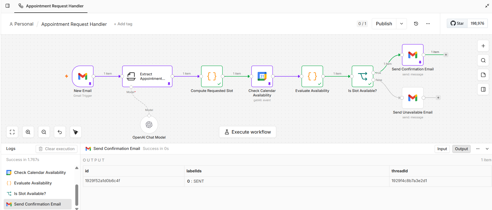

# AI Appointment Booking Agent

A live AI agentic workflow that automatically handles appointment booking requests — no human needed.

Built with n8n, OpenAI, Gmail, and Google Calendar.

## What it does

Small businesses receive appointment requests by email constantly. This agent handles the entire booking process autonomously:

→ Watches Gmail every minute for new appointment request emails
→ Uses OpenAI to extract the date, time, and service requested
→ Checks Google Calendar for availability in real time
→ Sends a confirmation email if the slot is open
→ Sends an alternative time suggestion if the slot is taken

Zero human intervention required.

## Why this matters

This is the exact workflow pattern used in production Voice AI receptionist platforms — where a missed or delayed response means a lost customer for a small business. Automating it with an AI agent reduces response time from hours to seconds.

New Email → Extract Appointment Details (OpenAI) → Compute Requested Slot → Check Calendar Availability (Google Calendar) → Evaluate Availability → Is Slot Available? → Send Confirmation Email / Send Unavailable Email

## Tech stack

Component	Tool
Workflow orchestration	n8n
AI extraction	OpenAI GPT-4o-mini
Email trigger	Gmail
Calendar check	Google Calendar
Deployment	n8n Cloud (live, polling every minute)

## Status

Live and running in production on n8n Cloud.

## Built by

Archana Prakash — Staff TPM · Voice AI · End-to-End LLM Delivery
LinkedIn · RAG Chatbot Project
